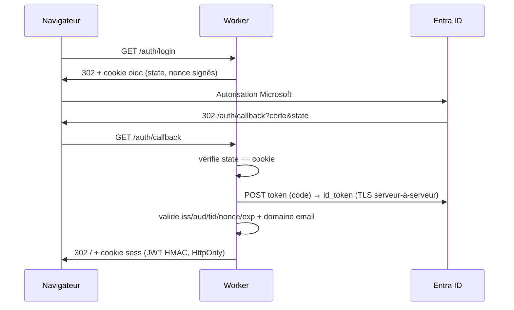
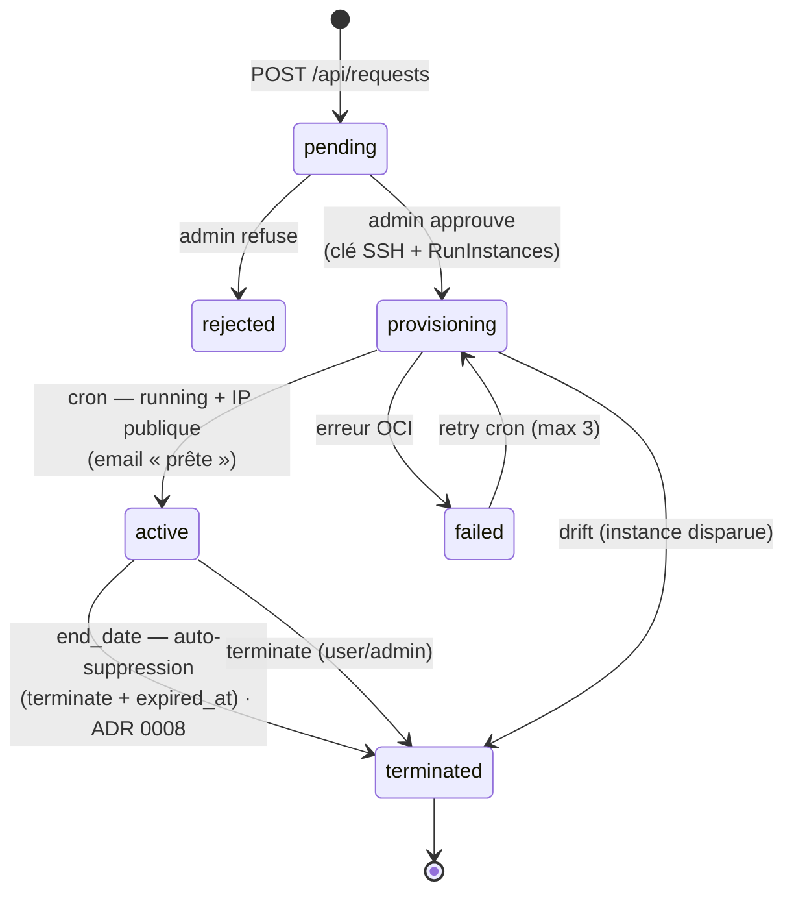
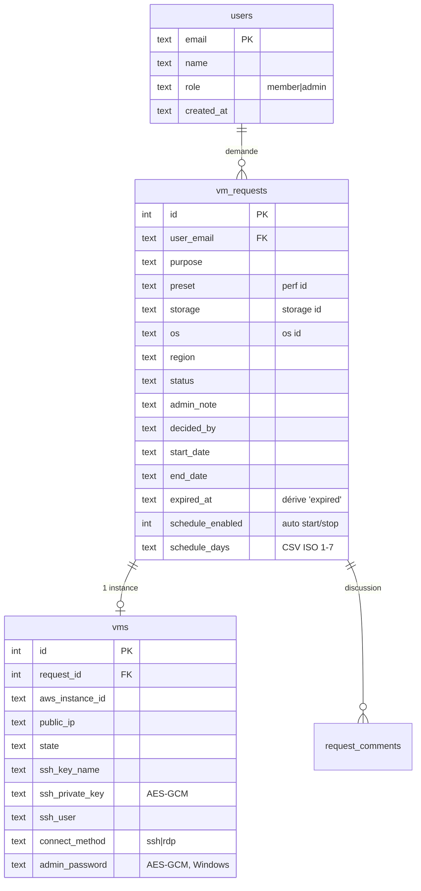
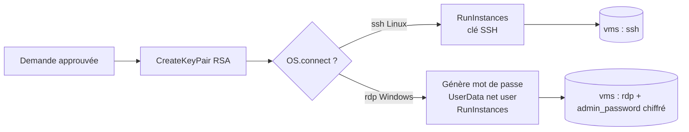

# Architecture — GIT VM Portal

> Vue technique du système : composants, flux, modèle de données, sécurité.
> Voir aussi [`../AGENTS.md`](../AGENTS.md), les [ADR](adr/) et [`DEPLOYMENT.md`](DEPLOYMENT.md).
> Dernière mise à jour : 2026-06-19.

---

## 1. Vue d'ensemble

Une seule unité déployable (un **Cloudflare Worker**) sert à la fois la **SPA React** (static assets)
et l'**API JSON** (Hono), et exécute des **tâches cron**. L'état désiré vit dans **D1** ; le réel vit
dans **OCI Compute** ; une cron réconcilie les deux en continu.

```mermaid
flowchart TB
    U[👤 Utilisateur<br/>navigateur] -->|HTTPS| W

    subgraph CF[Cloudflare]
        W[Worker Hono<br/>API + SPA + cron]
        A[(Static Assets<br/>web/dist)]
        D[(D1 — SQLite<br/>état désiré)]
        W --- A
        W --- D
    end

    W -->|OIDC| E[Microsoft Entra ID]
    W -->|Web Crypto (RSA-SHA256) / OCI API| OCI[OCI Compute<br/>eu-zurich-1]
    W -->|REST| M[EmailJS]
    W -.->|erreurs| S[Sentry optionnel]

    W -. cron */2 min .-> OCI
```

## 2. Composants

| Composant | Rôle | Fichiers |
|---|---|---|
| **Worker (API)** | Routes OIDC + API JSON + cron `scheduled()` | `src/index.ts` |
| **OIDC** | Flux authorization-code Entra ID (sans librairie) | `src/oidc.ts` |
| **Crypto** | JWT HMAC (sessions), AES-GCM (clés SSH + mots de passe Windows) | `src/crypto.ts` |
| **DB** | Accès D1 (requests, vms, users, audit, comments, metrics) | `src/db.ts` |
| **OCI** | Client OCI (REST/JSON, signature HTTP RSA-SHA256 en Web Crypto, génération clés SSH) | `src/oci.ts` |
| **Catalogue** | PERF × STORAGE × OS + coûts (source de vérité) | `src/presets.ts` |
| **Email** | Notifications EmailJS | `src/email.ts` |
| **SPA** | UI React (auth, Mes VM, Créer une VM, Détail, Admin) | `web/src/` |

## 3. Authentification (OIDC Entra ID)

Flux authorization-code, **entièrement côté Worker** ; le navigateur ne voit jamais le `id_token`.
Session = **JWT signé HMAC** dans un cookie `HttpOnly; Secure; SameSite=Lax` (TTL 8 h).



Garde-fous : `ALLOWED_EMAIL_DOMAINS` (domaines autorisés), `ADMIN_EMAILS` (admins bootstrap).
Diagnostic des pannes de login : [`analyse/04-diagnostic-login.md`](analyse/04-diagnostic-login.md).

## 4. Cycle de vie d'une demande



`approve` crée la clé/instance de façon **synchrone** ; le passage `provisioning → active` est fait
par la **cron** quand l'instance tourne avec une IP. À l'échéance, la VM est **supprimée**
(terminate) et `expired_at` est posé pour tracer l'auto-expiration — voir
[ADR 0008](adr/0008-suppression-auto-a-l-echeance.md) (supersède [ADR 0004](adr/0004-cycle-de-vie-reconciliateur.md)).

## 5. Le réconciliateur (cœur de la robustesse)

**DB = état désiré.** Deux déclencheurs cron (`wrangler.jsonc` → `triggers.crons`) :

| Cron | Fonction | Effet |
|---|---|---|
| `*/2 * * * *` | `reconcile` + `applySchedules` + `retryFailed` + `enforceExpiry` | sync OCI↔DB, drift, plannings, retries, échéances |
| `0 19 * * *` | `scheduledStop` | arrête les VM running sans planning (garde-fou coûts) |

- **`reconcile`** : `provisioning → active` (running + IP, + email), drift (instance disparue →
  `terminated`), sync de l'état running/stopped + IP.
- **`applySchedules`** : applique les **plannings auto start/stop** par VM (état désiré, Europe/Zurich) :
  dans la fenêtre + jour coché → la VM doit tourner, sinon arrêtée. `scheduledStop` (19 h) ignore ces VM.
- **`retryFailed`** : relance les provisioning échoués sans instance (max 3, compté dans l'audit log).
- **`enforceExpiry`** : à `end_date` → **supprime** la VM (terminate instance + clé) + `expired_at` +
  email ; e-mail de pré-échéance 24 h avant (sauvegarde) — [ADR 0008](adr/0008-suppression-auto-a-l-echeance.md).

> 🔒 **Règle** : toute nouvelle automatisation de cycle de vie **s'ajoute au réconciliateur**, pas
> dans un mécanisme parallèle.

## 6. Modèle de données (D1)



Migrations **100 % additives** (`ADD COLUMN`) pour éviter toute reconstruction de table sur D1 remote.

## 7. Catalogue & provisioning

Une demande compose **PERF** (shape OCI E-Flex) × **STORAGE** (boot volume) × **OS** (image). Les images
sont des **OCID `eu-zurich-1` concrets et vérifiés** (`scripts/oci-images.mjs`).



- **Linux** → SSH avec la clé privée téléchargeable (chiffrée au repos).
- **Windows** → RDP. Mot de passe Administrateur **généré**, injecté via **UserData (cloudbase-init)**,
  **chiffré AES-GCM**, révélé au propriétaire via `GET /api/requests/:id/password` (audité).
  Nécessite le **port 3389** ouvert sur le SG. Voir [ADR 0007](adr/0007-catalogue-os-et-windows-rdp.md).

## 8. Sécurité

| Aspect | Mise en œuvre |
|---|---|
| Auth | OIDC Entra ID in-Worker ; id_token jamais exposé au navigateur |
| Sessions | JWT HMAC signé maison, cookie `HttpOnly; Secure; SameSite=Lax` |
| Secrets d'exécution | Cloudflare Wrangler Secrets (jamais commités) — [ADR 0006](adr/0006-gestion-des-secrets.md) |
| Données sensibles au repos | Clés SSH **et** mots de passe Windows **chiffrés AES-GCM** (clé dérivée de `SESSION_SECRET`) |
| Contrôle d'accès | Clé/mot de passe récupérables **uniquement** par le propriétaire ou un admin |
| Traçabilité | `audit_log` sur login, demande, décision, provisioning, téléchargement clé, révélation mot de passe |
| Rate limiting | Max 5 demandes / heure / utilisateur |

## 9. Réseau OCI

VCN unique, **1 subnet public régional** + **1 security list** partagée (`eu-zurich-1`), créés par
`scripts/oci-setup.mjs`. Ingress : **tcp/22** (SSH) et **tcp/3389** (RDP Windows). Egress verrouillé en
liste blanche par `scripts/oci-harden.mjs`. IP publique auto-assignée par instance.

> ⚠️ **Limite connue** : pas d'isolation réseau par classe/cours (un seul subnet + SG). 3389 est
> ouvert en `0.0.0.0/0` pour la démo — **à restreindre** à une plage IP en production. Voir
> [`analyse/03-ecarts-et-dette-technique.md`](analyse/03-ecarts-et-dette-technique.md).

## 10. Surface API

| Méthode | Route | Auth | Rôle |
|---|---|---|---|
| GET | `/auth/login`, `/auth/callback` · POST `/auth/logout` | — | OIDC |
| GET | `/healthz`, `/api/me`, `/api/presets` | public / session | — |
| GET/POST | `/api/requests` | session | lister / créer |
| GET | `/api/requests/:id` · `/live` | propriétaire/admin | détail / état live |
| GET | `/api/requests/:id/key` · `/password` | propriétaire/admin | clé SSH / mot de passe RDP |
| POST | `/api/requests/:id/terminate` · `/start` · `/stop` · `/reboot` | propriétaire/admin | actions VM |
| GET/POST | `/api/requests/:id/comments` | propriétaire/admin | discussion |
| GET | `/api/admin/requests[.csv]` · `/stats` · `/metrics` · `/users` | admin | console |
| POST | `/api/admin/requests/:id/approve` · `/reject` · `/users/:email/role` | admin | validation / rôles |
| ALL | `*` | — | fallback SPA (static assets) |
