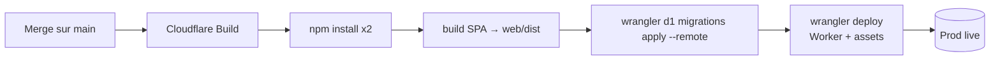

# Déploiement — GIT VM Portal

> Comment le projet est **construit, migré et publié**. Lis [`CONFIGURATION.md`](CONFIGURATION.md)
> pour les variables/secrets. Dernière mise à jour : 2026-06-19.

---

## 1. TL;DR — comment livrer

1. Travaille sur une **branche**, ouvre une **PR**, fais passer la CI (typecheck/lint/test/build).
2. **Merge sur `main`**.
3. **Cloudflare Workers Builds** prend le relais automatiquement : build → migrations D1 → déploiement.
4. Vérifie en live : `curl https://git-vm-oracle.satom-openstack.workers.dev/api/presets`.

> ❌ **Ne lance pas `wrangler deploy` à la main** en fonctionnement normal : Cloudflare le fait.
> Un déploiement manuel écraserait/dupliquerait le déploiement géré.

## 2. Deux pipelines distincts (ne pas confondre)

| | GitHub Actions (`.github/workflows/ci.yml`) | Cloudflare Workers Builds |
|---|---|---|
| Déclencheur | push sur `main` + pull requests | push/merge sur `main` |
| Rôle | **Vérifier** : typecheck worker + SPA, lint, tests, build | **Construire + migrer + déployer** |
| Déploie ? | **Non** | **Oui** |

C'est **Cloudflare** (intégration GitHub↔Cloudflare), **pas** la CI GitHub, qui publie.

## 3. Configuration Cloudflare Workers Builds

Dans le dashboard Cloudflare → Worker `git-vm-portal` → **Build** :

- **Git repository** : `Thomas-TP/GIT-VM`
- **Build command** :
  ```
  npm install && npm --prefix web install && npm --prefix web run build
  ```
- **Deploy command** :
  ```
  npx wrangler d1 migrations apply git_vm_oracle --remote && npx wrangler deploy
  ```
- **Production branch** : `main`
- **Builds for non-production branches** : **Disabled** → une PR/branche **ne déploie rien**.
- **Build watch paths** : `*` (tout changement déclenche).

> 🔑 **Conséquence importante** : le deploy command applique les **migrations D1 remote
> automatiquement, avant `wrangler deploy`**. Il suffit donc d'ajouter un fichier
> `migrations/NNNN_*.sql` et de merger sur `main` — la migration part avec le déploiement.
> (Le code lit ces colonnes ; appliquer la migration *avant* le deploy évite tout 500.)

## 4. Ce que fait un déploiement



`wrangler deploy` lit `wrangler.jsonc` : bindings D1, `vars` publiques, **assets** (`web/dist`,
fallback SPA), `triggers.crons`, `run_worker_first` (les routes OIDC/API doivent atteindre le Worker
avant le fallback SPA).

## 5. Vérifier un déploiement

```bash
# Le catalogue public reflète le code déployé
curl https://git-vm-oracle.satom-openstack.workers.dev/api/presets

# Logs live (debug)
npx wrangler tail git-vm-oracle --format pretty

# Santé
curl https://git-vm-oracle.satom-openstack.workers.dev/healthz   # {"ok":true}
```

## 6. Rollback

- **Option A (recommandée)** : `git revert <commit>` sur `main` → re-déclenche un build qui
  redéploie la version précédente. Les migrations étant additives, un revert de code ne « dé-migre »
  pas (et n'a pas besoin de le faire).
- **Option B** : Cloudflare dashboard → Worker → **Deployments** → *Rollback* vers une version
  antérieure (rollback du code Worker uniquement, pas de la DB).

## 7. Déploiement manuel (secours uniquement)

Si l'intégration Cloudflare est indisponible et qu'il faut publier en urgence :

```bash
npm --prefix web run build
npx wrangler d1 migrations apply git_vm_oracle --remote   # si nouvelles migrations
npx wrangler deploy
```

Nécessite un `wrangler login` (ou `CLOUDFLARE_API_TOKEN`) avec les droits Workers + D1. À éviter en
temps normal (désynchronise l'historique de déploiement géré par Cloudflare).

## 8. Mise en place initiale (one-time)

Déjà fait pour cet environnement, documenté pour reproductibilité :

1. **D1** : `wrangler d1 create git_vm_oracle` → reporter l'`database_id` dans `wrangler.jsonc`.
2. **Migrations** : `wrangler d1 migrations apply git_vm_oracle --remote`.
3. **Secrets** : `wrangler secret put <NAME>` pour chacun (voir [CONFIGURATION.md](CONFIGURATION.md)).
4. **Réseau OCI** : subnet + security list (SSH 22). Pour Windows : `node scripts/oci-setup.mjs`
   (ouvre 3389 — **à restreindre** à une plage IP en prod).
5. **AMIs** : `node scripts/oci-images.mjs` pour récupérer/rafraîchir les IDs `eu-zurich-1`.
6. **Entra** : redirect URI = `https://<domaine>/auth/callback` (voir CONFIGURATION.md).
7. **Cloudflare Build** : connecter le repo, renseigner build/deploy commands (§3).

## 9. Crons (déployés avec le Worker)

| Cron | Action |
|---|---|
| `*/2 * * * *` | réconciliation OCI↔DB + retries + échéances |
| `0 19 * * *` (UTC) | extinction des VM running (garde-fou coûts) |

Définis dans `wrangler.jsonc` → `triggers.crons`, gérés par `scheduled()` dans `src/index.ts`.

## 10. Domaine

Prod sur `*.workers.dev` : `https://git-vm-oracle.satom-openstack.workers.dev` (= `APP_URL`).
Pour un domaine custom : ajouter une route/Custom Domain au Worker dans Cloudflare et mettre à jour
`APP_URL` **et** la redirect URI Entra.
